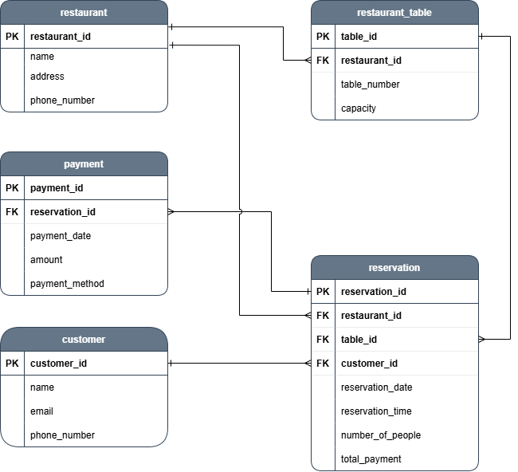

# Sistem Reservasi Restoran

## Deskripsi Project
### Latar Belakang
Dalam era digital saat ini, manajemen reservasi restoran yang efisien sangat penting untuk memastikan kepuasan pelanggan dan optimalisasi operasi bisnis. Proyek ini bertujuan untuk mengembangkan sebuah sistem basis data untuk manajemen reservasi restoran yang mencakup pelanggan, restoran, meja, reservasi, dan pembayaran.

### Tujuan Proyek
1. Mempermudah Manajemen Reservasi: Mengurangi beban kerja staf restoran dengan mengotomatisasi proses reservasi.
2. Mengoptimalkan Utilisasi Meja: Memastikan meja dikelola secara efisien untuk memaksimalkan kapasitas restoran.
3. Meningkatkan Pengalaman Pelanggan: Memberikan pengalaman reservasi yang mulus dan cepat untuk pelanggan.
4. Pencatatan Pembayaran yang Akurat: Memastikan semua pembayaran tercatat dengan benar untuk keperluan akuntansi dan audit.

### Lingkup Proyek
Sistem ini akan mencakup komponen-komponen berikut:
1. Manajemen Pelanggan: Penyimpanan data pelanggan termasuk nama, email, dan nomor telepon.
2. Manajemen Restoran: Penyimpanan data restoran termasuk nama, alamat, dan nomor telepon.
3. Manajemen Meja: Penyimpanan data meja termasuk nomor meja, kapasitas, dan asosiasi dengan restoran.
4. Manajemen Reservasi: Penyimpanan data reservasi termasuk tanggal, waktu, jumlah orang, dan total pembayaran.
5. Manajemen Pembayaran: Penyimpanan data pembayaran termasuk tanggal pembayaran, jumlah, dan metode pembayaran.

### Spesifikasi Teknis
1. Basis Data: MySQL
2. Bahasa Pemrograman: SQL untuk operasi basis data
3. Indexing: Digunakan untuk mempercepat query
4. View: Digunakan untuk menyederhanakan query yang kompleks
5. Trigger: Digunakan untuk otomatisasi perhitungan total pembayaran

## Entity Relationship Diagram


## Relasi
1. customer ke reservation (one to many)
Satu pelanggan (customer) dapat membuat banyak reservasi (reservation), tetapi setiap reservasi hanya dapat dibuat oleh satu pelanggan. Ini diimplementasikan melalui customer_id sebagai foreign key di tabel reservation, menghubungkannya ke tabel customer.

2. restaurant ke restaurant_table (one to many)
Satu restoran (restaurant) dapat memiliki banyak meja (restaurant_table), tetapi setiap meja hanya dapat dimiliki oleh satu restoran. Ini diimplementasikan melalui restaurant_id sebagai foreign key di tabel restaurant_table, menghubungkannya ke tabel restaurant.

3. restaurant ke reservation (one to many)
Satu restoran (restaurant) dapat menerima banyak reservasi (reservation), tetapi setiap reservasi hanya dapat dilakukan di satu restoran. Ini diimplementasikan melalui restaurant_id sebagai foreign key di tabel reservation, menghubungkannya ke tabel restaurant.

4. restaurant_table ke reservation (one to many)
Satu meja di restoran (restaurant_table) dapat digunakan untuk banyak reservasi (reservation), tetapi setiap reservasi hanya dapat dilakukan untuk satu meja. Ini diimplementasikan melalui table_id sebagai foreign key di tabel reservation, menghubungkannya ke tabel restaurant_table.

5. reservation ke payment (one to many)
Satu reservasi (reservation) dapat memiliki banyak pembayaran (payment), tetapi setiap pembayaran hanya dapat terkait dengan satu reservasi. Ini diimplementasikan melalui reservation_id sebagai foreign key di tabel payment, menghubungkannya ke tabel reservation.

## Skema Basis Data
```sql
-- Tabel
CREATE TABLE customer (
    customer_id INT PRIMARY KEY AUTO_INCREMENT,
    NAME VARCHAR(100) NOT NULL,
    email VARCHAR(100) UNIQUE NOT NULL,
    phone_number VARCHAR(15) NOT NULL
);

CREATE TABLE restaurant (
    restaurant_id INT PRIMARY KEY AUTO_INCREMENT,
    NAME VARCHAR(100) NOT NULL,
    address VARCHAR(255) NOT NULL,
    phone_number VARCHAR(15) NOT NULL
);

CREATE TABLE restaurant_table (
    table_id INT PRIMARY KEY AUTO_INCREMENT,
    restaurant_id INT,
    table_number INT NOT NULL,
    capacity INT NOT NULL,
    FOREIGN KEY (restaurant_id) REFERENCES restaurant(restaurant_id)
);

CREATE TABLE reservation (
    reservation_id INT PRIMARY KEY AUTO_INCREMENT,
    customer_id INT,
    restaurant_id INT,
    table_id INT,
    reservation_date DATE NOT NULL,
    reservation_time TIME NOT NULL,
    number_of_people INT NOT NULL,
    FOREIGN KEY (customer_id) REFERENCES customer(customer_id),
    FOREIGN KEY (restaurant_id) REFERENCES restaurant(restaurant_id),
    FOREIGN KEY (table_id) REFERENCES restaurant_table(table_id)
);

CREATE TABLE payment (
    payment_id INT PRIMARY KEY AUTO_INCREMENT,
    reservation_id INT,
    payment_date DATE NOT NULL,
    amount DECIMAL(10, 2) NOT NULL,
    payment_method VARCHAR(50) NOT NULL,
    FOREIGN KEY (reservation_id) REFERENCES reservation(reservation_id)
);

-- Index
CREATE INDEX idx_reservation_customer_id ON reservation(customer_id);
CREATE INDEX idx_restaurant_id ON restaurant(restaurant_id);
CREATE INDEX idx_table_id ON restaurant_table(table_id);
CREATE INDEX idx_reservation_date ON reservation(reservation_date);
CREATE INDEX idx_reservation_time ON reservation(reservation_time);
CREATE INDEX idx_payment_reservation_id ON payment(reservation_id);
CREATE INDEX idx_customer_name ON customer(NAME);
CREATE INDEX idx_customer_id ON customer(customer_id);

-- Trigger
DELIMITER //
CREATE TRIGGER update_table_capacity_after_reservation
AFTER INSERT ON reservation
FOR EACH ROW
BEGIN
    UPDATE restaurant_table
    SET capacity = capacity - NEW.number_of_people
    WHERE table_id = NEW.table_id;
END;
//
DELIMITER ;

-- Trigger 2
DELIMITER //
CREATE TRIGGER update_total_payments_after_insert
AFTER INSERT ON payment
FOR EACH ROW
BEGIN
    DECLARE total DECIMAL(10, 2);
    
    SELECT SUM(amount) INTO total
    FROM payment
    WHERE reservation_id = NEW.reservation_id;
    
    UPDATE reservation
    SET total_payment = total
    WHERE reservation_id = NEW.reservation_id;
END;
//
DELIMITER ;

-- View
CREATE VIEW reservation_details AS
SELECT
    r.reservation_id,
    c.name AS customer_name,
    c.email AS customer_email,
    rest.name AS restaurant_name,
    rt.table_number,
    r.reservation_date,
    r.reservation_time,
    r.number_of_people
FROM
    reservation r
JOIN
    customer c ON r.customer_id = c.customer_id
JOIN
    restaurant rest ON r.restaurant_id = rest.restaurant_id
JOIN
    restaurant_table rt ON r.table_id = rt.table_id;

-- View 2
CREATE VIEW reservation_payment_details AS
SELECT
    r.reservation_id,
    c.name AS customer_name,
    rest.name AS restaurant_name,
    rt.table_number,
    r.reservation_date,
    r.reservation_time,
    r.number_of_people,
    p.total_payment
FROM
    reservation r
JOIN
    customer c ON r.customer_id = c.customer_id
JOIN
    restaurant rest ON r.restaurant_id = rest.restaurant_id
JOIN
    restaurant_table rt ON r.table_id = rt.table_id
LEFT JOIN
    (SELECT reservation_id, SUM(amount) AS total_payment
     FROM payment
     GROUP BY reservation_id) p ON r.reservation_id = p.reservation_id;

-- View 3
CREATE VIEW customers_with_multiple_reservations AS
SELECT
    c.customer_id,
    c.name AS customer_name,
    COUNT(r.reservation_id) AS total_reservations
FROM
    customer c
LEFT JOIN
    reservation r ON c.customer_id = r.customer_id
WHERE
    c.name LIKE '%John%'
GROUP BY
    c.customer_id, c.name
HAVING
    COUNT(r.reservation_id) > 1;
```
## Index
```sql
CREATE INDEX idx_reservation_customer_id ON reservation(customer_id);
CREATE INDEX idx_restaurant_id ON restaurant(restaurant_id);
CREATE INDEX idx_table_id ON restaurant_table(table_id);
CREATE INDEX idx_reservation_date ON reservation(reservation_date);
CREATE INDEX idx_reservation_time ON reservation(reservation_time);
CREATE INDEX idx_payment_reservation_id ON payment(reservation_id);
CREATE INDEX idx_customer_name ON customer(NAME);
CREATE INDEX idx_customer_id ON customer(customer_id);
```
Berikut ini adalah alasan kenapa index tersebut diperlukan:
1. idx_reservation_customer_id pada reservation(customer_id): Digunakan dalam operasi JOIN antara tabel reservation dan customer. Indeks ini akan mempercepat penggabungan data berdasarkan customer_id.
2. idx_restaurant_id pada restaurant(restaurant_id): Digunakan dalam operasi JOIN antara tabel reservation dan restaurant. Indeks ini akan mempercepat penggabungan data berdasarkan restaurant_id.
3. idx_table_id pada restaurant_table(table_id): Digunakan dalam operasi JOIN antara tabel reservation dan restaurant_table. Indeks ini akan mempercepat penggabungan data berdasarkan table_id.
4. idx_reservation_date pada reservation(reservation_date): Digunakan untuk melakukan pencarian atau pengurutan berdasarkan tanggal reservasi (reservation_date), indeks ini akan mempercepat kinerja query yang memanfaatkan kolom ini.
5. idx_reservation_time pada reservation(reservation_time): Digunakan untuk melakukan pencarian atau pengurutan berdasarkan waktu reservasi (reservation_time), indeks ini akan mempercepat kinerja query yang memanfaatkan kolom ini.
6. idx_payment_reservation_id pada payment(reservation_id): Digunakan untuk menggabungkan data dari subquery yang menghitung total pembayaran (total_payment) berdasarkan reservation_id. Indeks ini akan mempercepat operasi penggabungan data antara reservation dan payment.
7. idx_customer_name pada customer(name): Digunakan dalam kondisi pencarian (WHERE c.name LIKE '%John%'). Indeks ini akan mempercepat pencarian data pelanggan berdasarkan nama.
8. idx_customer_id pada customer(customer_id): Digunakan dalam operasi JOIN antara tabel customer dan reservation. Indeks ini akan mempercepat penggabungan data berdasarkan customer_id.

## Trigger

## View
